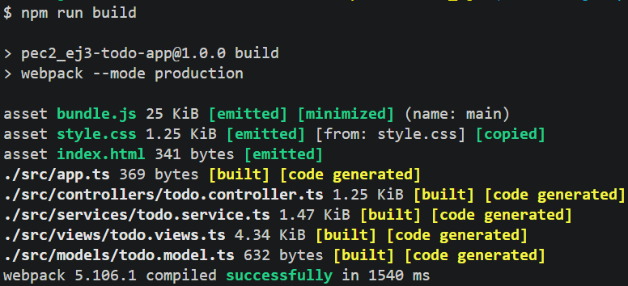

# 3️⃣ T3-todo-mvc-app (guide)

## Description
TODO application built in TypeScript following the *MVC* architecture:
- **todo.model.ts**. Defines the data structure of a task.
- **todo.service.ts**. Handles CRUD operations and persistence in *localStorage*.
- **todo.view.ts**. Controls rendering and DOM events.
- **todo.controller.ts**. Connects the service with the view.

## Project structure
```
PEC2_Ej3/  
├─ src/  
│  ├─ controllers/  
│  │  └─ todo.controller.ts  
│  ├─ models/  
│  │   └─ todo.model.ts  
│  ├─ services/  
│  │   └─ todo.service.ts  
│  ├─ views/  
│  │   └─ todo.views.ts  
│  ├─ index.html  
│  └─ app.ts  
├─ dist/                      // Generated when running the command
│  ├─ bundle.js  
│  ├─ index.html  
│  └─ style.css  
├─ img/  
│  ├─ index.png 
│  ├─ npmrunbuild.png 
│  └─ npmrunbuilddev.png
├─ style.css  
├─ tsconfig.json  
├─ webpack.config.js  
├─ package.json  
└─ package-lock.json 
```

## Prerequisites
- Node.js 
- npm v9
- tsc

## Installing dependencies
```bash
npm install
```

## Option 1 - Compile with tsc (TypeScript only)
Compiles the `.ts` files into `.js` in the `dist/` folder.  

```bash
npm run tsc
```

> This option does not generate the bundle, nor does it copy the HTML or CSS.

## Option 2 - Compile with Webpack (recommended)
Webpack transpiles all TypeScript files and generates a single `bundle.js` file in `dist/`, bundling all modules together, along with the `index.html` file with the *script defer src="bundle.js"* tag automatically injected, and the `style.css`.

### Development build
```bash
npm run build:dev
```


### Production build
```bash
npm run build
```


The difference between these two ways of running the project lies in how Webpack generates the final files.  
With `npm run build:dev`, the generated files have a more readable structure, are not optimized, and take up more lines and space, unlike the files generated with the `npm run build` command.

## Running the application
Open the `dist/index.html` file in the browser (with *Live Server*, for example).

## Available scripts
| Command | Description |
| --- | --- |
| `npm install` | Installs all dependencies |
| `npm run build` | Compiles with webpack in production mode |
| `npm run build:dev` | Compiles with webpack in development mode |
| `npm run tsc` | Transpiles everything with tsc |

## Development dependencies (devDependencies)
| Package | Use |
| --- | --- |
| `typescript` | TypeScript compiler |
| `webpack` | Module bundler |
| `webpack-cli` | Webpack CLI |
| `ts-loader` | Loader for webpack to process `.ts` files |
| `html-webpack-plugin` | Generates the `index.html` file in `dist/` |
| `copy-webpack-plugin` | Copies the `style.css` file into `dist/` |