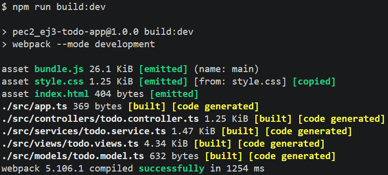

# 3️⃣ PEC2_Ej3 - Aplicacion_TODO

## Descripción
Aplicación TODO construida en TypeScript siguiendo la arquitectura *MVC*:
- **todo.model.ts**. Define la estructura de datos de una tarea.
- **todo.service.ts**. Gestiona las operaciones CRUD y la persistencia en *localStorage*.
- **todo.view.ts**. Controla el renderizado y los eventos del DOM.
- **todo.controller.ts**. Conecta el servicio con la vista.

## Estructura del proyecto
```
PEC2_Ej3/  
├─ src/  
│  ├─ controllers/  
│  │  └─ todo.controller.ts  
│  ├─ models/  
│  │   └─ todo.model.ts  
│  ├─ services/  
│  │   └─ todo.service.ts  
│  ├─ views/  
│  │   └─ todo.views.ts  
│  ├─ index.html  
│  └─ app.ts  
├─ dist/              
│  ├─ bundle.js  
│  ├─ index.html  
│  └─ style.css  
├─ img/  
│  ├─ npmrunbuild.png 
│  └─ npmrunbuilddev.png
├─ style.css  
├─ tsconfig.json  
├─ webpack.config.js  
├─ package.json  
└─ README_PEC2_Ej3.md  
```

## Requisitos previos
- Node.js 
- npm v9
- tsc

## Instalación de dependencias
```bash
npm install
```

## Opción 1 - Compilar con tsc (solo TypeScript)
Compila los archivos `.ts` a `.js` en la carpeta `dist/`.  

```bash
npm run tsc
```

> Esta opción no genera el bundle ni copia el HTML ni el CSS.  
> No es suficiente para ejecutar la aplicación en el navegador.

## Opción 2 - Compilar con Webpack (reocmendado)
Webpack transpila todos los archivos TypeScript y genera un único fichero `bundle.js` en `dist/`, donde empaqueta todos los módulos, junto con el `index.html` con el *script defer src="bundle.js"* inyectado automáticamente y el `style.css`.

### Build de desarrollo
```bash
npm run build:dev
```


### Build de producción
```bash
npm run build
```


La diferencia entre estas dos maneras de ejecutar el proyecto es cómo Webpack genera los archivos finales.  
Con `npm run build:dev`, los archivos generados tienen una estructura más legible, no están optimizados y ocupan más líneas y espacio, a diferencia de los generados con el comando `npm run build`.

## Ejecutar la aplicación
Abre el fichero `dist/index.html` en el navegador (con *Live Server*, por ejemplo).

## Scripts disponibles
| Comando | Descripción |
| --- | --- |
| `npm install` | Instala todas las dependencias |
| `npm run build` | Compila con webpack en modo producción |
| `npm run build:dev` | Compila con webpack en modo desarrollo |
| `npm run tsc` | Transpila todo a tsc |

## Dependencias de desarrollo (devDependencies)
| Pauqete | Uso |
| --- | --- |
| `typescript` | Compilador de TypeScript |
| `webpack` | Empaquetador de módulos |
| `webpack-cli` | CLI de webpack |
| `ts-loader` | Loader para que webpack procese `.ts` |
| `html-webpack-plugin` | Genera el `index.html` en `dist/` |
| `ts-loader` | Copia el `style.css` en `dist/` |