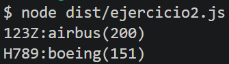

# ⚡ PEC 2 - Desarrollo Frontend con Framework JavaScript

  
<sub>🗓️ Desarrollado en abril del 2026</sub>

| Campo | Valor |
|---|---|
| **Login UOC** | mturur |
| **Nombre** | Marc Turu Roca |
| **Máster** | Desarrollo de Sitios y Aplicaciones Web |

--- 

## Decisiones técnicas generales

### Estructura de ramas

Se ha trabajado con ramas Git a pesar de ser un proyecto individual, con el objetivo de mantener un historial limpio y organizado. Los merges se han realizado con `--no-ff` para preservar el commit de merge aunque la rama base no hubiera cambiado.

## Ejercicios

### 1️⃣ PEC2_Ej1 - Primeros códigos
Respuestas en [PEC2_Ej1_respuestas_teoria.md](PEC2_Ej1/PEC2_Ej1_respuestas_teoria.md).

### 2️⃣ PEC2_Ej2

#### **Ejecución:**
```bash
tsc
node dist/ejercicio<n>.js
```
donde **n** es el número de alguno de los tres ejericios.

---

#### **a) tsconfig.json**
Nigúna aclaración a destacar.

#### **b) ejercicio1.txt**
En esta parte:
```ts
let array:number[]=[2,3,4];
console.log(array.shift()); //2
printArray(array); // 3,4
```
debido a que se espera `3` y `4` solamente después, no se puede hacer 
```ts
console.log(array[0]); //2
```
, ya que no se eliminaría el `2`. 

Aquí:
```ts
console.log(array.sort().join(',')); //1,3,4,8
console.log(array.reverse().join(',')); //8,4,3,1
```
se añadieron los `.join(',')` (aparte del `reverse()` que faltaba) para que las salidas coincidieran, ya que `console.log()` imprime los arrays diferentes.  
También se podría haber hecho:
```ts
printArray(array.sort());
printArray(array.reverse());
```
pero se quiso cambiar lo mínimo posible el código no indicado con /**/.


#### **c) ejercicio2.txt**
Aquí, se decidió crear un *index signature* para definir el tipo de objeto para tipar el diccionario.  
Despúes, simplemente se recorrieron los dos elementos de `myHangar` y se mostraron con la estructura indicada en el comentario.



#### **d) ejercicio3.txt**
La línea `Animal.population++` en el constructor de la superclase se ejecuta cada vez que se instancia cualquier subclase (`super()` presente en las constructoras de las subclases).  
En el bucle, por un lado se reutiliza la función `sound()` para las dos subclases, pero por otro lado, se necesita recurrir a un condicional para diferenciar qué función utilizar dependiendo de la tipología de la instancia de Animal (`instanceof`). 


### 3️⃣ PEC2_Ej3 - Aplicación TODO

Guía completa en [README_PEC2_Ej3.md](PEC2_Ej3/README_PEC2_Ej3.md).

#### **Ejecución:** (recomendada con Webpack)

Instalar dependencias:
```bash
npm install
```

Para desarrollo:
```bash
npm run build:dev 
```
Para producción:
```bash
npm run build
```
Abrir el fichero `dist/index.html` en el navegador (con *Live Server*, por ejemplo).

---

En **`todo.service.ts`** se planteó usar:
```ts
export interface ITodoService {
  todos: ITodo[];
  onTodoListChanged: (todos: ITodo[]) => void;
}
```
pero debido a que en la clase `TodoService` las propiedades eran `private`, había incosnsistencia en la declaraicón de la interfaz y la clase, por lo que se optó por renunciar al uso de esta primera.

En la siguiente función (ya adaptada) de **`todo.views.ts`**:
```ts
getElement(selector: string): HTMLElement {
  const element = document.querySelector<HTMLElement>(selector);
  if (!element) throw new Error(`Element ${selector} not found`);
  return element;
}
```
se usó `HTMLElement` en el `querySelector` para indicar a TypeScript el tipo esperado del elemento seleccionado, permitiendo acceder a sus propiedades. Además se añadió la comprobación condicional porque `querySelector` puede devolver `null`, valor no compatible con el tipo de retorno de `HTMLElement`.

En la función `displayTodos(todos: ITodo[]): void` de **`todo.views.ts`**, para solucionar el error *"Property 'type' does not exist on type 'HTMLElement'"* que aparecía en las siguientes líneas (sin adaptar aún):
```ts
const checkbox = this.createElement("input");
  checkbox.type = "checkbox";
  checkbox.checked = todo.complete;
```
se agregó `as HTMLInputElement` porque `createElement` devuelve un `HTMLElement`, que no incluye propiedades específicas como `type` y `checked` propias de `HTMLInputElement`.    
También se transformó a `'true'` la línea:
```ts
span.contentEditable = true;
```
ya que `contentEditable` está definida como `string` en el DOM Typescript.

Como último cambio importante a comentar, todas los callbacks de eventos se tiparon como `event: Event` y se añadió `const target = event.target as HTMLElement;` antes de la comprobación condicional para solucioanr el error *"'event.target' is possibly 'null'"*, ya que su tipo es `EventTarget | null` y TypeScript no puede saber que sea un `HTMLElement` sin esta conversión.

En `todo.controller.ts` surgió el problema de que no se podía acceder al atributo privado `todos`, específicamente en la siguiente línea:
```ts
this.onTodoListChanged(this.service.todos);
```
debido a que, como se comentó al principio, en la clase `TodoService` las propiedades eran `private`. Para solucionarlo, se renombró el atributo de esa clase como `_todos` y se creó un *getter* para poder acceder a dicho atributo:
```ts
get todos(): ITodo[] {
  return [...this._todos];
}
```
Además de substituir las declaraciónes donde aparecía dicho atributo con la nueva convención **'_'**.

---

> Marc Turu Roca · Máster Universitario de Desarrollo de Sitios y Aplicaciones Web