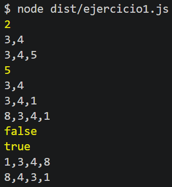
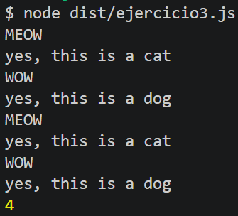
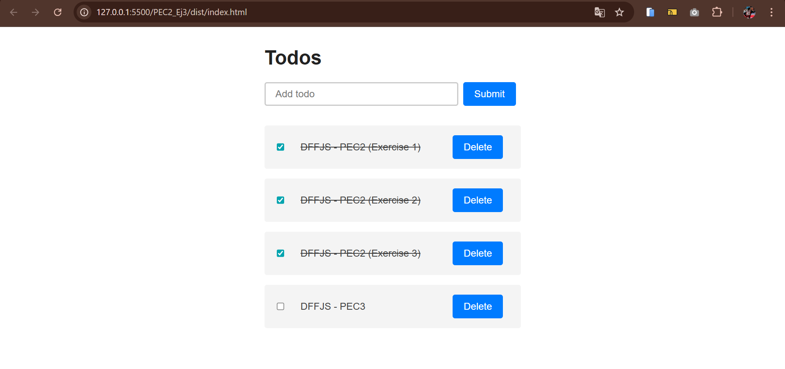

# ☑️ - Todo MVC

  
<sub>🗓️ Developed in April 2026</sub>

This project consists of three independent phases: **/1-theoretical-questions**, **/2-typescript-exercises** and **/3-todo-mvc**.

## ✅ Features

- **/1-theoretical-questions**: 4 initial questions about TypeScript and its characteristics (errors, types, classes, interfaces).
- **/2-typescript-exercises**: 3 exercises completed in order to match the expected outputs (which are shown in the lines with `//`).
- **/3-todo-mvc**: MVC web app to replicate a **TODO list**.

---

## 🛠 Installation & Setup

### 1. Clone the repository
```bash
git clone https://github.com/marcturu/todo-mvc.git
```

### 2. Run locally
Follow the instructions to run the exercises **/2-typescript-exercises** and **/3-todo-mvc**.

---

## Exercises

### 1️⃣ /1-theoretical-questions
Answers in **[1-theoretical-questions/ANSWERS.md](1-theoretical-questions/ANSWERS.md)**.

### 2️⃣ /2-typescript-exercises

#### **Execution:**
```bash
tsc
node dist/ex<n>.js
```
where **n** is the number of one of the three exercises.

---

#### **a) tsconfig.json**
No particular remarks.

#### **b) ex1.ts**
In this part:
```ts
let array:number[]=[2,3,4];
console.log(array.shift()); //2
printArray(array); // 3,4
```
since only `3` and `4` are expected afterwards, it is not possible to do
```ts
console.log(array[0]); //2
```
as this would not remove the `2`.

Here:
```ts
console.log(array.sort().join(',')); //1,3,4,8
console.log(array.reverse().join(',')); //8,4,3,1
```
the `.join(',')` calls were added (besides the missing `reverse()`) so the outputs would match, since `console.log()` prints arrays differently.  
An alternative would have been:
```ts
printArray(array.sort());
printArray(array.reverse());
```
but the goal was to change as little as possible of the code not marked with `/**/`.



#### **c) ex2.ts**
Here, an *index signature* was created to define the object type used to type the dictionary.  
Afterwards, the two elements of `myHangar` were simply iterated over and displayed with the structure indicated in the comment.


#### **d) ex3.ts**
The line `Animal.population++` in the superclass constructor runs every time any subclass is instantiated (since `super()` is present in the subclasses' constructors).  
In the loop, the `sound()` function is reused for both subclasses, but on the other hand, a conditional is needed to determine which function to use depending on the type of the `Animal` instance (`instanceof`).  
Additional changes that could have been made but were deliberately avoided, since the instructions explicitly stated *"Replace /* * */ with the appropriate instructions that fulfill the operations and outputs indicated in the comments"*:
- As with `sound()`, replacing the `iamadog` and `iamacat` functions with a single one sharing the same name, e.g. `whoami`, so that the loop would not need an `instanceof` check.
- Adding the `: void` type to the `iamadog` and `iamacat` functions.



### 3️⃣ /3-todo-mvc-app

Full guide in **[3-todo-mvc-app/GUIDE.md](3-todo-mvc-app/GUIDE.md)**.

#### **Execution:** (Webpack recommended)

Install dependencies:
```bash
npm install
```

For development:
```bash
npm run build:dev 
```
For production:
```bash
npm run build
```
Open the `dist/index.html` file in the browser (with *Live Server*, for example).

---

In **`todo.service.ts`**, using the following was initially considered:
```ts
export interface ITodoService {
  todos: ITodo[];
  onTodoListChanged: (todos: ITodo[]) => void;
}
```
but since the properties in the `TodoService` class were `private`, there was an inconsistency between the interface declaration and the class, so this approach was dropped.

In the following (already adapted) function from **`todo.views.ts`**:
```ts
getElement(selector: string): HTMLElement {
  const element = document.querySelector<HTMLElement>(selector);
  if (!element) throw new Error(`Element ${selector} not found`);
  return element;
}
```
`HTMLElement` was used in `querySelector` to tell TypeScript the expected type of the selected element, allowing access to its properties. A conditional check was also added because `querySelector` can return `null`, a value incompatible with the `HTMLElement` return type.

In the `displayTodos(todos: ITodo[]): void` function in **`todo.views.ts`**, to fix the error *"Property 'type' does not exist on type 'HTMLElement'"* that appeared on the following (not yet adapted) lines:
```ts
const checkbox = this.createElement("input");
  checkbox.type = "checkbox";
  checkbox.checked = todo.complete;
```
`as HTMLInputElement` was added because `createElement` returns an `HTMLElement`, which does not include specific properties such as `type` and `checked` that belong to `HTMLInputElement`.  
The following line was also converted to `'true'`:
```ts
span.contentEditable = true;
```
since `contentEditable` is defined as `string` in the DOM TypeScript typings.

As a final notable change, all event callbacks were typed as `event: Event`, and `const target = event.target as HTMLElement;` was added before the conditional check to fix the error *"'event.target' is possibly 'null'"*, since its type is `EventTarget | null` and TypeScript cannot infer it is an `HTMLElement` without this conversion.

In **`todo.controller.ts`**, an issue arose where the private `todos` attribute could not be accessed, specifically on the following line:
```ts
this.onTodoListChanged(this.service.todos);
```
because, as mentioned earlier, the properties in the `TodoService` class were `private`. To solve this, the attribute in that class was renamed to `_todos` and a *getter* was created to access it:
```ts
get todos(): ITodo[] {
  return [...this._todos];
}
```
All declarations referencing that attribute were also updated to follow the new **'_'** naming convention.


